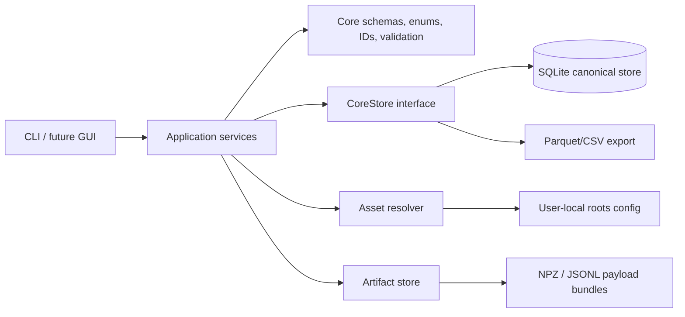
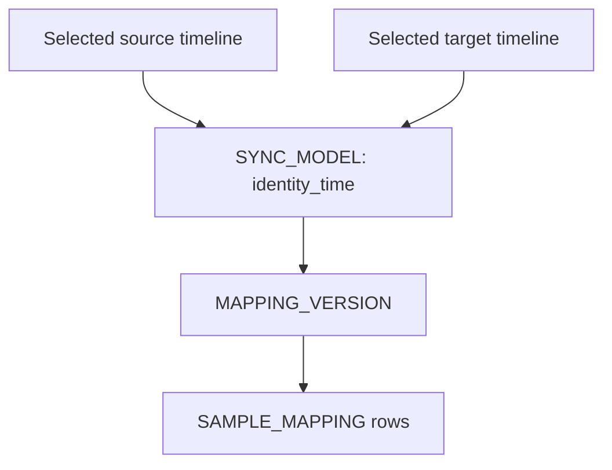
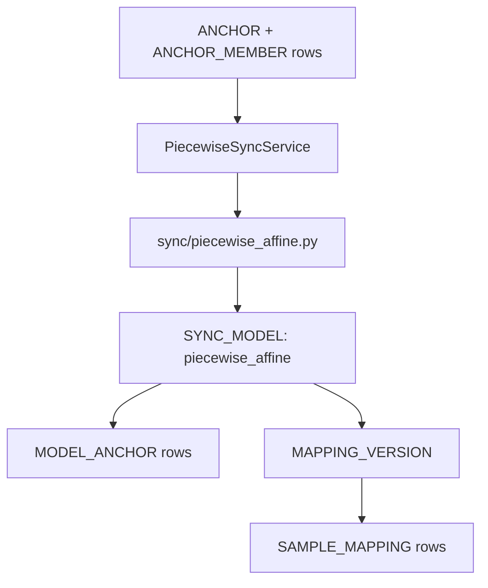

# v0.2.2 architecture overview

The backend has no GUI dependency. A future Qt GUI should call the service layer
rather than directly reading pandas dataframes or SQLite tables.

## Main services

- `IngestionService`: reads the temporary package and writes the canonical store.
- `MappingService`: generates initial nearest-time mappings using selected source and target timelines.
- `ArtifactBuildService`: builds run-level payload bundles and writes artifact metadata.
- `PayloadService`: retrieves sample payloads by canonical sample identity.
- `PairInspectionService`: retrieves mapped-pair metadata, summaries, payload roles, and payload shapes.
- `ArtifactAuditService`: checks artifact file/metadata consistency.
- `AnchorService`: creates, lists, deletes, exports, and imports canonical anchors.
- `AssetService`: resolves `RUN_ASSET` rows against simple local roots.
- `VideoFrameService`: retrieves RGB MP4 frames by canonical sample index.
- `MappingLookupService`: supports source-target navigation for GUI sync controls.
- `PiecewiseSyncService`: fits official piecewise-affine sync models and generates revised mapping versions.

## Mapping provenance

Even the crude nearest-frame mapping is represented as a derived mapping version
from an explicit sync model.

## Initial Nearest Mapping

The v0.1 nearest mapping is an anchor-placement aid. It is intended to give the
future GUI or notebook workflow a default target frame to jump to when browsing
from RGB to radar.

For this mapping method, `is_primary=True` means “selected default navigation candidate under the configured primary policy”, not “trusted final synchronised correspondence”.

The default v0.1 `primary_policy` is `supported-only`, so weakly supported rows are kept as candidates but are not marked primary. Less conservative policies such as `within-max-delta` or `nearest-any` can be selected explicitly.

Final or anchor-derived mappings must be generated as separate `MAPPING_VERSION`
rows from an anchor-based `SYNC_MODEL`.

## Mapping overwrite policy

`map-nearest` and `map-nearest-all` refuse to reuse an existing `mapping_version_id` by default. If `--overwrite` is passed, existing `SAMPLE_MAPPING` rows for that mapping version are deleted before regenerated rows are inserted.

## v0.2.2 piecewise workflow

The piecewise-affine algorithm is official backend code. The synthetic probes and anchoring GUI are experimental clients of the service layer.
