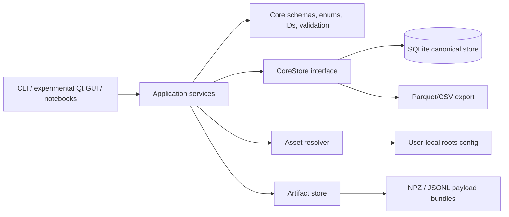
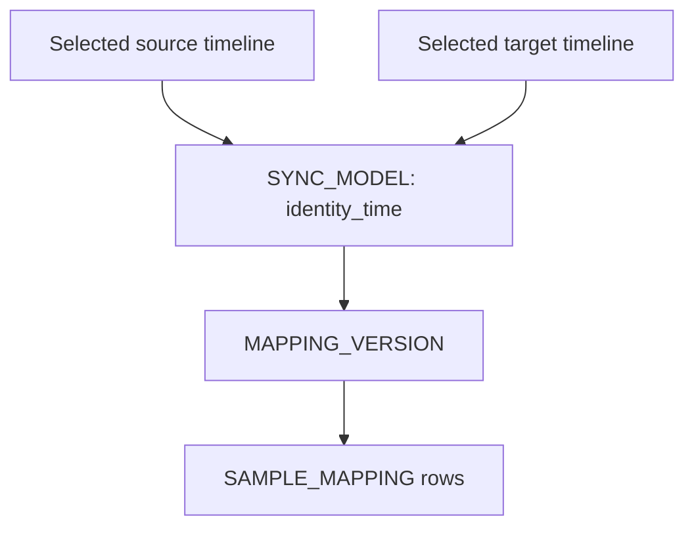
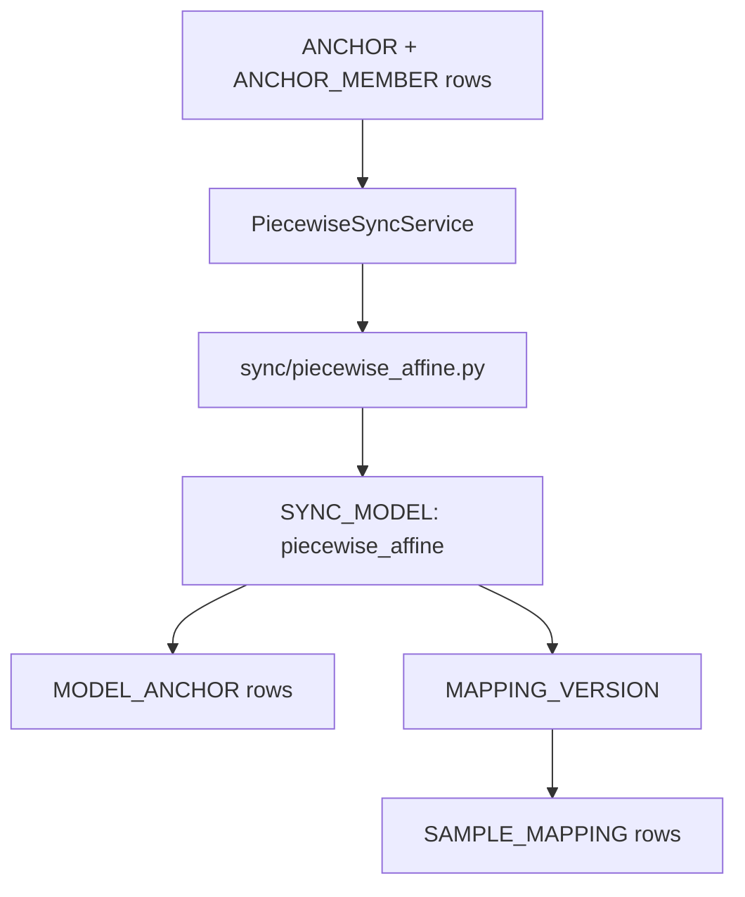

# SyncWB architecture overview

This describes the current backend, versioned cloud import, experimental GUI,
and portable student deployment. The [ER diagram](er_diagram.mmd) shows all
canonical tables and logical keys from `core/tables.py`.

```mermaid
flowchart LR
    CLI[CLI / experimental Qt GUI / notebooks] --> Services[Application services]
    Services --> Core[Core schemas, enums, IDs, validation]
    Services --> Storage[CoreStore interface]
    Services --> Assets[Asset resolver]
    Services --> Artifacts[Artifact store]
    Storage --> SQLite[(SQLite canonical store)]
    Storage --> Export[Parquet/CSV export]
    Artifacts --> Bundles[NPZ / JSONL payload bundles]
    Assets --> Roots[User-local roots config]
```

The backend has no required GUI dependency. The experimental Qt GUI uses services
for payload access, anchors, video and mapping navigation. Its session-selection
adapter also reads canonical registry/mapping metadata to find compatible choices.

## Main services

- `IngestionService`: reads the temporary package and writes the canonical store.
- `RawPointCloudImportService`: validates versioned offline raw packages, reuses acquisition samples/timelines, and registers immutable cloud bundles.
- `MappingService`: generates initial nearest-time mappings using selected source and target timelines.
- `ArtifactBuildService`: builds run-level payload bundles and writes artifact metadata.
- `PayloadService`: lists cloud versions and retrieves sample payloads/summaries by canonical sample identity and selected cloud version.
- `PairInspectionService`: retrieves mapped-pair metadata, summaries, payload roles, and payload shapes.
- `ArtifactAuditService`: checks artifact file/metadata consistency.
- `AnchorService`: creates, lists, deletes, exports, and imports canonical anchors.
- `AssetService`: resolves `RUN_ASSET` rows against simple local roots.
- `VideoFrameService`: retrieves RGB MP4 frames by canonical sample index.
- `MappingLookupService`: supports source-target navigation for GUI sync controls.
- `PiecewiseSyncService`: fits official piecewise-affine sync models and generates revised mapping versions.

## Acquisition and payload versions

`services/training_export_service.py` implements the read-only HPE export boundary:
homogeneous cloud/mapping selection, supported run overlap, common relative time,
radar-centred nearest-pose correspondence and separate modality HDF5 files.
GUI and export share geometry in `core/geometry.py`: optional validated desk-v2
Kinect/raw-radar extrinsics followed by the historical floor transform. Calibration
is fixed per session/export and embedded with its hash in geometry provenance;
see [spatial calibration](../spatial_calibration.md).
The export manifest freezes recipe/profile/release identities without changing
the canonical schema. See [training exports](../training_export.md).

One `DEVICE_RUN` represents one uninterrupted acquisition. Its `RUN_SAMPLE` rows,
timeline estimates, anchor endpoints and mapping rows are shared across offline
processing results. `POINT_CLOUD_VERSION` registers those results; `RUN_ASSET`,
`SAMPLE_ARTIFACT` and `SAMPLE_SUMMARY` carry `point_cloud_version_id`.
Sample artifacts and summaries include the version in their logical keys.
`SAMPLE_SUMMARY.point_status` distinguishes an available empty cloud from a frame
that was not processed.

`migrate-point-clouds` copies and migrates an existing database.
`import-raw-point-clouds` imports the checked pickle/manifest pair and writes
immutable NPZ bundles. Legacy ingestion/build commands reject this package.
Offline payload access requires an explicit version once non-legacy raw versions
are registered. See [the import contract](../raw_point_cloud_package.md).

Version IDs identify completed results bound to their acquisitions. Cross-session
settings comparison uses the configuration and generator/calibration provenance;
the training exporter computes a conservative shared recipe fingerprint in its
manifest. The canonical cloud registry continues to store result identities.

## GUI sessions and portable assignments

The launch selector fixes one cloud source/version and compatible mapping for
the session. Anchor/export provenance records the displayed cloud and display
settings; anchor endpoints continue to identify captured samples.

The deployment package builder exports one subject/pair/cloud with its initial
navigation mapping, assets, application source and setup scripts. Students work
in a local database. Anchor writes/imports are transactional, recovery JSON
snapshots are retained, and return imports handle duplicates/conflicts.
See [student packages](../student_package.md) and [anchor returns](../anchor_returns.md).

## Mapping provenance

```mermaid
flowchart TD
    A[Selected source timeline] --> S[SYNC_MODEL: identity_time]
    B[Selected target timeline] --> S
    S --> M[MAPPING_VERSION]
    M --> R[SAMPLE_MAPPING rows]
```

Even the crude nearest-frame mapping is represented as a derived mapping version
from an explicit sync model.

## Initial Nearest Mapping

The v0.1 nearest mapping is an anchor-placement aid. It is intended to give the
experimental GUI or notebook workflow a default target frame to jump to when browsing
from RGB to radar.

For this mapping method, `is_primary=True` means “selected default navigation candidate under the configured primary policy”, not “trusted final synchronised correspondence”.

The default v0.1 `primary_policy` is `supported-only`, so weakly supported rows are kept as candidates but are not marked primary. Less conservative policies such as `within-max-delta` or `nearest-any` can be selected explicitly.

Final or anchor-derived mappings must be generated as separate `MAPPING_VERSION`
rows from an anchor-based `SYNC_MODEL`.

## Mapping overwrite policy

`map-nearest` and `map-nearest-all` refuse to reuse an existing `mapping_version_id` by default. If `--overwrite` is passed, existing `SAMPLE_MAPPING` rows for that mapping version are deleted before regenerated rows are inserted.

## v0.2.2 piecewise workflow

```mermaid
flowchart TD
    A[ANCHOR + ANCHOR_MEMBER rows] --> P[PiecewiseSyncService]
    P --> ALG[sync/piecewise_affine.py]
    ALG --> S[SYNC_MODEL: piecewise_affine]
    S --> MA[MODEL_ANCHOR rows]
    S --> MV[MAPPING_VERSION]
    MV --> SM[SAMPLE_MAPPING rows]
```

The piecewise-affine algorithm is official backend code. The synthetic probes and anchoring GUI are experimental clients of the service layer.
