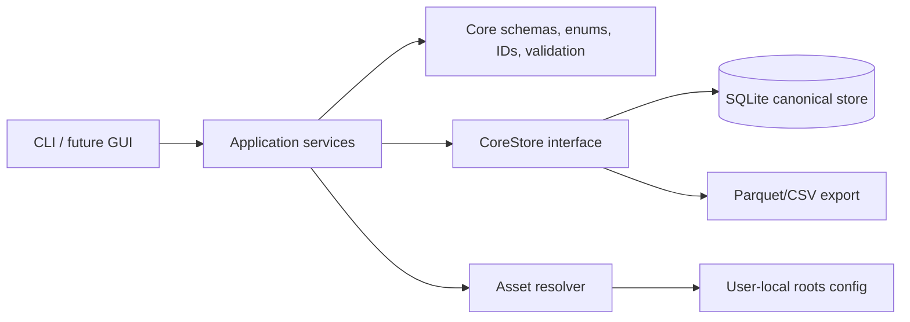
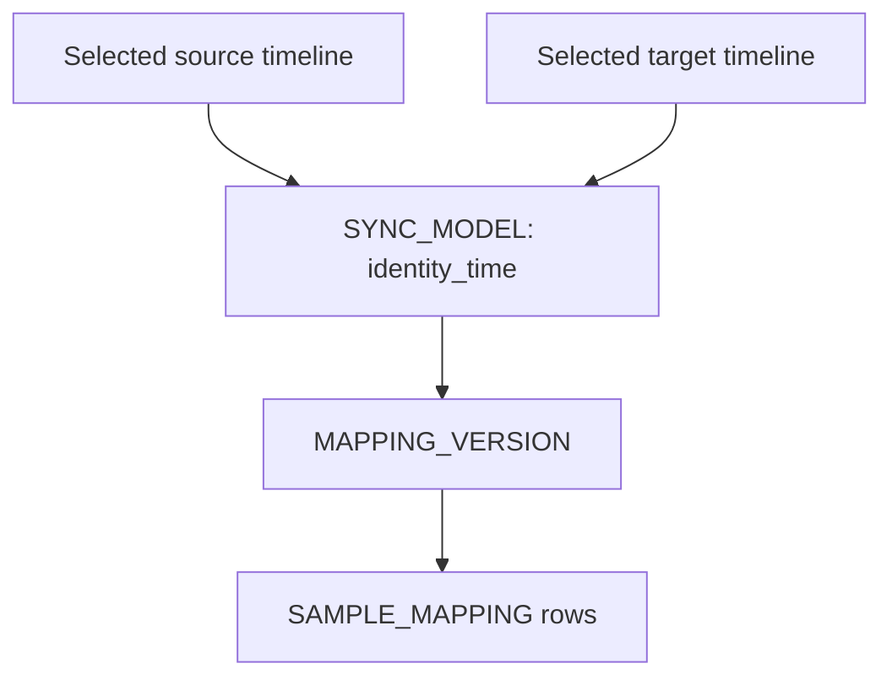

# v0.1 architecture overview

The backend has no GUI dependency. A future Qt GUI should call the service layer
rather than directly reading pandas dataframes or SQLite tables.

## Main v0.1 services

- `IngestionService`: reads the temporary package and writes the canonical store.
- `MappingService`: generates initial nearest-time mappings using selected
  source and target timelines.

## Mapping provenance

Even the crude nearest-frame mapping is represented as a derived mapping version
from an explicit sync model.

## Initial Nearest Mapping

The v0.1 nearest mapping is an anchor-placement aid. It is intended to give the
future GUI or notebook workflow a default target frame to jump to when browsing
from RGB to radar.

For this mapping method, `is_primary=True` means “default navigation candidate”,
not “trusted synchronised correspondence”. Rows with `support_status=weak_support`
may still be primary if they are the nearest available candidate.

Final or anchor-derived mappings must be generated as separate `MAPPING_VERSION`
rows from an anchor-based `SYNC_MODEL`.